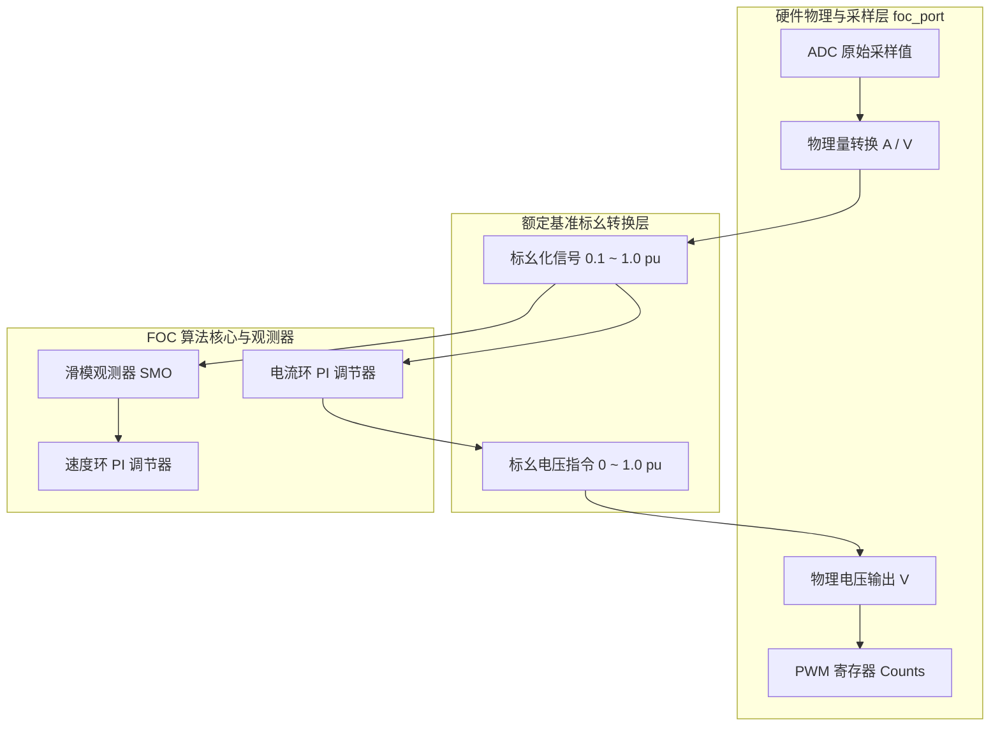

> [!WARNING]
> **本文档已被 [`docs/superpowers/plans/2026-09-14-foc-parameter-identification-implementation.md`](superpowers/plans/2026-09-14-foc-parameter-identification-implementation.md) 取代（superseded）。**
> 二者存在实质性矛盾，实施以取代文档为准：
> - 本方案的 `L_pu = L / Z_base` **量纲错误**；正确关系为 `L_pu = L / L_base`。
> - 电流环 PI、速度 PI 与 SMO 参数自动整定不属于取代计划的范围。
> - Identify 生命周期属于独立模块与 App 编排；`motor_t` 不增加辨识状态、回调或专用生命周期 API。
>
> 本文档仅作背景设计笔记保留。

# 电机参数整定与标幺化工程设计方案

## 1. 方案背景与核心痛点

在电机 FOC（磁场定向控制）控制系统工程化落地的过程中，算法的稳定性与控制性能高度依赖于**电机本体物理参数的准确性**（相电阻 $R_s$、直交轴电感 $L_d, L_q$、永磁磁链 $\psi_f$）以及**内部计算的数值精度**。

### 1.1 核心工程痛点
1. **参数不准导致算法恶化**：
   - 电流环 PI 的解耦、抗饱和与带宽整定依赖 $R$ 与 $L$；
   - 滑模观测器（SMO）或无感磁链观测器（Flux Observer）的反电势估计方程严格依赖 $\frac{R}{L}$ 和 $\frac{1}{L}$。参数偏差会导致估算角度抖动、带载失步甚至飞车。
2. **小电机在通用硬件下的“小数值量化掉精度”问题**：
   - 功率驱动板（如 STM32G431 + 3-Shunt 采样）通常按系统最大允许能力设计（例如全量程 $I_{hw\_max} = 6.45\text{ A}$）；
   - 当接入微型云台电机、无人机小空心杯等电机时，电机额定电流仅为 $200\text{ mA} \sim 500\text{ mA}$；
   - 若直接以硬件全量程 $6.45\text{ A}$ 作为算法标幺系统的基准（$1.0\text{ pu}$），则电机的额定工况电流仅为：
     $$I_{rated\_pu} = \frac{0.3\text{ A}}{6.45\text{ A}} \approx 0.0465\text{ pu}$$
   - **定点数运算（Q15/Q24）灾难**：在 Q15 下（$1.0 = 32768$），$0.01\text{ pu}$ 对应计数值仅为 $327$ counts。有效位宽丢失 90% 以上，微小的微分差分可能全部被截断为 0，积分增益退化为 $0.000x$，带来严重的量化噪声与极限环震荡；
   - **浮点数运算缺陷**：虽然动态范围大，但在与 $1.0\text{ pu}$ 发生加减运算时（如 $1.0 - \text{duty}$），微小增益会产生灾难性消去，降低信噪比。

---

## 2. 两级基准标幺化架构 (Double-Base Architecture)

为彻底根除小数值掉精度问题，本方案采用工业级（TI InstaSPIN / ST MC SDK 级）的**硬件全量程基准与电机额定基准完全解耦的分离架构**。



### 2.1 硬件基准 (Hardware Base)
- **定义**：由板载硬件电路（分流电阻阻值 $R_{shunt}$、运放放大倍数 $G$、ADC 参考电压 $V_{ref}$、母线电压 $V_{bus}$）唯一决定的物理极限。
- **作用域**：仅作用于底层的硬件接口驱动（`foc_port.c`），负责 ADC 采样原始值到物理量（安培 A、伏特 V）的转换，不参与算法核心。
- **当前 STM32G431 硬件配置**：
  $$I_{hw\_max} = \frac{ADC_{max}}{65536} \times \frac{V_{ref}}{R_{shunt} \times G_{opamp}} = \frac{41000}{65536} \times \frac{3.3\text{ V}}{0.02\,\Omega \times 16} \approx 6.45\text{ A}$$
  $$U_{hw\_max} = V_{bus\_nominal} = 12.0\text{ V}$$

### 2.2 电机额定基准 (Motor Rated Base)
- **定义**：根据所挂载的电机本身的名牌参数或应用需求设定的基准值。
- **作用域**：控制算法、PID、滑模观测器、限幅器内部唯一的标幺化尺度。
- **配置接口**：开放为可配置参数或工程宏定义：
  ```c
  #define FOC_BASE_VOLTAGE_V       12.0f   /* 基准电压 12V (母线或额定相电压) */
  #define FOC_BASE_CURRENT_A       1.0f    /* 电机额定相电流 1.0A (针对微型电机可设为 0.5A) */
  #define FOC_BASE_SPEED_RPM       3000.0f /* 电机额定机械转速 (RPM) */
  #define FOC_MOTOR_POLE_PAIRS     4U      /* 电机极对数 */
  ```
- **核心收益**：
  - 用户在控制台输入 `motor current 0.0 0.8` 时，含义明确为“输出 80% 额定电流（0.8A）”，直观安全；
  - 算法内部所有的电流和电压变量在额定工况下均运行在 $0.5 \sim 1.0\text{ pu}$ 的最佳动态范围区间；
  - 彻底杜绝 $0.000x$ 等微小数值，定点数有效位宽利用率达 100%！

---

### 2.3 标幺化参数全景与导出基准严格推导

> [!IMPORTANT]
> **核心定理**：我们**绝不需要（也不允许）人为去给 $R_s, L_d, L_q$ 单独设定“额定电阻”或“额定电感”**！
> 在电气工程中，只要选定了 **三大独立基础基准**（基准电压 $U_{base}$、基准电流 $I_{base}$、基准电角速度 $\omega_{base}$），根据欧姆定律与麦克斯韦方程组，**所有其他参数（电阻、电感、磁链、转矩、功率）的标幺基准就被数学公式唯一、自动地确定（即导出基准，Derived Base Values）**。

#### 1. FOC 标幺化参数全景映射表

| 类别 | 参数名称 | 物理符号与单位 | 标幺符号 | 决定方式与导出基准公式 |
| :--- | :--- | :--- | :--- | :--- |
| **三大独立基础基准** | **基准电压**<br>**基准电流**<br>**基准电角速度** | $U_{base}\ (\text{V})$<br>$I_{base}\ (\text{A})$<br>$\omega_{base}\ (\text{rad/s})$ | $1.0\text{ pu}$<br>$1.0\text{ pu}$<br>$1.0\text{ pu}$ | **用户名牌配置给定**（如 12V、1.0A、3000RPM）<br>其中 $\omega_{base} = 2\pi \cdot \frac{n_{rated} \cdot p}{60}$ |
| **电机本体参数** | **相电阻**<br>**直轴电感**<br>**交轴电感**<br>**永磁磁链** | $R_s\ (\Omega)$<br>$L_d\ (\text{H})$<br>$L_q\ (\text{H})$<br>$\psi_f\ (\text{Wb 或 V}\cdot\text{s})$ | $R_{pu}$<br>$L_{d\_pu}$<br>$L_{q\_pu}$<br>$\psi_{pu}$ | **阻抗基准**：$Z_{base} = \frac{U_{base}}{I_{base}}\quad (\Omega)$<br>**电感基准**：$L_{base} = \frac{Z_{base}}{\omega_{base}} = \frac{U_{base}}{I_{base} \cdot \omega_{base}}\quad (\text{H})$<br>**电感基准**：$L_{base} = \frac{Z_{base}}{\omega_{base}} = \frac{U_{base}}{I_{base} \cdot \omega_{base}}\quad (\text{H})$<br>**磁链基准**：$\psi_{base} = \frac{U_{base}}{\omega_{base}}\quad (\text{V}\cdot\text{s})$ |
| **实时运行变量** | **dq 轴电压**<br>**dq 轴电流**<br>**电气角速度**<br>**电磁转矩** | $u_d, u_q\ (\text{V})$<br>$i_d, i_q\ (\text{A})$<br>$\omega_e\ (\text{rad/s})$<br>$T_e\ (\text{N}\cdot\text{m})$ | $u_{d\_pu}, u_{q\_pu}$<br>$i_{d\_pu}, i_{q\_pu}$<br>$\omega_{pu}$<br>$T_{pu}$ | $U_{base}$<br>$I_{base}$<br>$\omega_{base}$<br>**转矩基准**：$T_{base} = \frac{3}{2} p \cdot \psi_{base} \cdot I_{base}\quad (\text{N}\cdot\text{m})$ |
| **控制增益系数** | **电流环 PI 增益**<br>**SMO 衰减/步进增益** | $K_p, K_i$<br>$\text{Gain}_0, \text{Gain}_1$ | $K_{p\_pu}, K_{i\_pu}$<br>纯数字系数 | 由 $R_{pu}, L_{pu}$ 及控制周期 $T_s$ 自动求得，处于 $[0.05, 1.5]$ 黄金区间 |

#### 2. 本身参数标幺化数学推导

1. **电阻标幺化公式**：
   根据直流欧姆定律 $U = I \cdot R$：
   $$Z_{base} = \frac{U_{base}}{I_{base}}\quad (\Omega) \implies R_{s\_pu} = \frac{R_s}{Z_{base}} = \frac{R_s \cdot I_{base}}{U_{base}}$$
2. **电感标幺化公式**：
   电感在交流系统中的阻抗表现为感抗 $X_L = \omega \cdot L$（量纲为 $\Omega$）。
   当转速达到额定基准角速度 $\omega_{base}$ 时，基准感抗必须与系统基准阻抗等价：
   $$X_{L\_base} = \omega_{base} \cdot L_{base} = Z_{base} = \frac{U_{base}}{I_{base}}$$
   因此，系统唯一电感基准严格导出为：
   $$L_{base} = \frac{Z_{base}}{\omega_{base}} = \frac{U_{base}}{I_{base} \cdot \omega_{base}}\quad (\text{H})$$
   直轴与交轴电感标幺值：
   $$L_{d\_pu} = \frac{L_d}{L_{base}} = \frac{L_d \cdot I_{base} \cdot \omega_{base}}{U_{base}}$$
   $$L_{q\_pu} = \frac{L_q}{L_{base}} = \frac{L_q \cdot I_{base} \cdot \omega_{base}}{U_{base}}$$
3. **磁链标幺化公式**：
   永磁体反电势幅值满足 $E = \omega_e \cdot \psi_f$。在额定电角频率 $\omega_{base}$ 下，反电势不能超过母线供电能力 $U_{base}$：
   $$\psi_{base} = \frac{U_{base}}{\omega_{base}}\quad (\text{Wb}) \implies \psi_{f\_pu} = \frac{\psi_f}{\psi_{base}} = \frac{\psi_f \cdot \omega_{base}}{U_{base}}$$

#### 3. 实际工程算例（证明数值区间健康性）
假设配置参数：$U_{base} = 12.0\text{ V}$，$I_{base} = 1.0\text{ A}$，$n_{rated} = 3000\text{ RPM}$，极对数 $p = 4$。
1. **导出系统基准**：
   - 额定电角速度：$\omega_{base} = 2\pi \times \frac{3000 \times 4}{60} \approx 1256.64\text{ rad/s}$；
   - 阻抗基准：$Z_{base} = \frac{12.0\text{ V}}{1.0\text{ A}} = 12.0\ \Omega$；
   - 电感基准：$L_{base} = \frac{12.0\ \Omega}{1256.64\text{ rad/s}} \approx 0.00955\text{ H} = 9550\ \mu\text{H}$；
   - 磁链基准：$\psi_{base} = \frac{12.0\text{ V}}{1256.64\text{ rad/s}} \approx 0.00955\text{ Wb}$。
2. **带入辨识测得的实际物理量**：
   若 `motor identify` 实测相电阻 $R_s = 600\text{ m}\Omega = 0.6\ \Omega$，电感 $L_d = 950\ \mu\text{H}$：
   - 标幺电阻：$R_{s\_pu} = \frac{0.6\ \Omega}{12.0\ \Omega} = 0.050\text{ pu}$；
   - 标幺电感：$L_{d\_pu} = \frac{950\ \mu\text{H}}{9550\ \mu\text{H}} \approx 0.0995\text{ pu}$。
3. **数值优势验证**：
   标幺值 $R_{pu} = 0.05$ 与 $L_{pu} = 0.10$ 落在完美的$[0.02, 0.5]$ 动态范围区间内：
   - 在 Q15 定点数下，分别对应 $1638$ counts 与 $3276$ counts，完全保有 12~15 位的完整有效精度；
   - 在浮点数运算中，数值与 $1.0$ 的量级差距仅在一到两个数量级以内，完全避免了灾难性精度损失与下溢！

#### 4. 代码层自动化宏体系设计
在工程中，算法代码自动计算导出基准，禁止人工硬编码算错：
```c
/* ==================== 1. 电机额定基准输入 (用户可按需修改) ==================== */
#define FOC_BASE_VOLTAGE_V       12.0f   /* 基准电压 12V */
#define FOC_BASE_CURRENT_A       1.0f    /* 电机额定电流 1.0A (针对微型电机可配 0.5A) */
#define FOC_BASE_SPEED_RPM       3000.0f /* 额定机械转速 (RPM) */
#define FOC_MOTOR_POLE_PAIRS     4U      /* 电机极对数 */

/* ==================== 2. 系统严格导出的标幺基准 (只读自动计算) ==================== */
#define FOC_BASE_IMPEDANCE_OHM   (FOC_BASE_VOLTAGE_V / FOC_BASE_CURRENT_A)
#define FOC_BASE_E_OMEGA_RAD_S   (2.0f * 3.14159265f * \
                                  (FOC_BASE_SPEED_RPM * FOC_MOTOR_POLE_PAIRS / 60.0f))
#define FOC_BASE_INDUCTANCE_H    (FOC_BASE_IMPEDANCE_OHM / FOC_BASE_E_OMEGA_RAD_S)
#define FOC_BASE_FLUX_WB         (FOC_BASE_VOLTAGE_V / FOC_BASE_E_OMEGA_RAD_S)
#define FOC_BASE_TORQUE_NM       (1.5f * FOC_MOTOR_POLE_PAIRS * \
                                  FOC_BASE_FLUX_WB * FOC_BASE_CURRENT_A)
```

## 3. 电机本体参数整定 (Parameter Identification)

`identify` 模块的目标是：**通过受控高频激励，测量出电机固有的客观物理参数，其输出为严格的国际单位制物理量（毫欧 $\text{m}\Omega$、微亨 $\mu\text{H}$）**，与任何标幺基准无关。

### 3.1 相电阻 $R_s$ 测量原理
在电机转子静止锁死状态（或将初始电角度锁在 $\theta_e = 0$ 零位），对直轴（D 轴）施加两级阶跃电压：

```text
注入电压 Ud
     ▲
Full |                 ┌────────────────────
     |                 │ Full Voltage (Uh)
Half |   ┌─────────────┘ Half Voltage (Uh/2)
     |   │
   0 └───┴─────────────┴────────────────────► 时间 t
         │◄-SettleTime-►◄-SettleTime-►
采集电流 Id
     ▲
Ifull|                               ......
Ihalf|                  .....
     |   . . . .
   0 └───┴─────────────┴────────────────────► 时间 t
```

1. **第 1 阶段（半压注入）**：
   - 注入电压：$U_{d1} = \frac{1}{2} U_h$（如全量程的 $5\%$）；
   - 稳定延时 $T_{settle}$ 后，采集直轴稳态电流 $I_{d1}$；
2. **第 2 阶段（全压注入）**：
   - 注入电压：$U_{d2} = U_h$（如全量程的 $10\%$）；
   - 稳定延时 $T_{settle}$ 后，采集直轴稳态电流 $I_{d2}$；
3. **消除功率管死区与对地压降的差分电阻计算**：
   利用两点差分法有效抵消逆变器管压降与测量固定偏移：
   $$\Delta U = U_{d2} - U_{d1} = \frac{1}{2} U_h$$
   $$\Delta I = I_{d2} - I_{d1}$$
   $$R_s = \frac{\Delta U}{\Delta I} = \frac{U_h}{2 \cdot (I_{d2} - I_{d1})}$$
4. **单位换算**：
   输出物理电阻：$R_s(\text{m}\Omega) = R_s(\Omega) \times 1000$。

---

### 3.2 电感 $L_d, L_q$ 测量原理 (RL 阶跃 95% 理论)

对于一阶 RL 电路，施加恒定阶跃电压 $U_h$ 时，电感中的电流响应方程为：
$$i(t) = I_{final} \left( 1 - e^{-\frac{t}{\tau}} \right)$$
其中电路时间常数 $\tau = \frac{L}{R_s}$，$I_{final} = \frac{U_h}{R_s}$ 即上一步测得的全压稳态电流 $I_{d2}$。

1. **数学推导**：
   设定电流上升阈值为稳态电流的 $95\%$（即 $i(t) = 0.95 \cdot I_{final}$）：
   $$1 - e^{-\frac{t_{rise}}{\tau}} = 0.95 \implies e^{-\frac{t_{rise}}{\tau}} = 0.05 = \frac{1}{20}$$
   两边取自然对数：
   $$-\frac{t_{rise}}{\tau} = -\ln(20) \implies \tau = \frac{t_{rise}}{\ln(20)}$$
   代入 $\tau = \frac{L}{R_s}$ 得到：
   $$L = R_s \cdot \tau = R_s \cdot t_{rise} \cdot \frac{1}{\ln(20)}$$
   其中常数项：
   $$\frac{1}{\ln(20)} \approx \frac{1}{2.99573227} \approx 0.3338082f$$

2. **D 轴电感 $L_d$ 测量流程**：
   - **放电复位**：$U_d = 0$，等待电流衰减至阈值 $|I_d| \le I_{reset}$（如 $<0.01\text{ pu}$）；
   - **施加阶跃**：注入电压 $U_d = U_h$；
   - **离散计时**：在每个高频中断周期 $T_s$（$50\mu\text{s}$）中累加计时器 $t_{rise}$；
   - **达标停止**：当检测到采样电流 $I_d \ge 0.95 \cdot I_{final}$ 时，停止计时，关闭输出；
   - **结算电感**：$L_d = R_s \times t_{rise} \times 0.3338082f$。
3. **Q 轴电感 $L_q$ 测量流程**：
   - 同样逻辑施加在 Q 轴：先复位使 $I_q \approx 0$，然后在 Q 轴注入 $U_q = U_h$，记录 $I_q$ 充至 $95\%$ 的时间 $t_{rise\_q}$；
   - 结算电感：$L_q = R_s \times t_{rise\_q} \times 0.3338082f$。
4. **单位换算**：
   输出物理电感：$L(\mu\text{H}) = L(\text{H}) \times 10^6$。

---

## 4. 物理参数到算法控制系数的自动推导与标幺映射

一旦获得 $R_s(\text{m}\Omega)$、$L_d(\mu\text{H})$、$L_q(\mu\text{H})$，系统将结合用户设定的**电机额定基准**（$I_{rated}, U_{rated}$），自动计算各控制环路的最优标幺增益。

### 4.1 基准阻抗与归一化
- 电机额定基准阻抗：
  $$Z_{base} = \frac{U_{rated}}{I_{rated}}\quad (\Omega)$$
- 电机电阻标幺值：
  $$R_{pu} = \frac{R_s(\Omega)}{Z_{base}} = \frac{R_s(\text{m}\Omega) / 1000}{Z_{base}}$$
- 电机电感标幺值：
  $$L_{d\_pu} = \frac{L_d(\text{H})}{Z_{base}} = \frac{L_d(\mu\text{H}) \times 10^{-6}}{Z_{base}}$$

---

### 4.2 电流环 PI 参数自动整定（零极点对消法）
在连续域中，PMSM 电流环开环传递函数为 $G(s) = \frac{1}{L s + R}$。
采用经典 PI 控制器 $C(s) = K_p + \frac{K_i}{s} = K_p \frac{s + K_i / K_p}{s}$。
为消除电机电气极点（Pole-Zero Cancellation），令：
$$\frac{K_i}{s} \implies \frac{K_i}{K_p} = \frac{R}{L}$$
此时闭环系统退化为一阶纯惯性环节，闭环截止频率设为 $\omega_c = 2\pi f_c$（典型取开关频率的 $1/10 \sim 1/20$，如 $1000\text{ Hz} \approx 6283\text{ rad/s}$）：
$$K_p = \omega_c \cdot L$$
$$K_i = \omega_c \cdot R$$

**自动折算到离散标幺化系统**：
- 在标幺离散时间步长 $T_s$ 下：
  $$K_{p\_pu} = \omega_c \cdot \frac{L_{d\_pu}}{Z_{base}}$$
  $$K_{i\_Ts\_pu} = K_i \cdot T_s = \omega_c \cdot \frac{R_{pu}}{Z_{base}} \cdot T_s$$
- 这样计算出来的 $K_p$ 和 $K_{i}T_s$ 均落在 $[0.05, 1.5]$ 之间的黄金动态范围，彻底避免了过小或溢出。

---

### 4.3 滑模观测器 (SMO) 系数自动初始化
滑模观测器状态方程（Sguan SMO 离散形式）：
$$i_s[k+1] = i_s[k] + \Delta t \left( \frac{1}{L} u_s[k] - \frac{R}{L} i_s[k] - \frac{1}{L} e_s[k] \right)$$

将标幺量代入，得到 SMO 积分步进增益：
- **交叉步进衰减项**：
  $$\text{Gain}_0 = 1 - \frac{R_s}{L_s} \cdot T_s$$
- **输入电压步进增益**：
  $$\text{Gain}_1 = \frac{T_s}{L_s} \cdot Z_{base}$$
- **观测器滑模增益**：
  $$H = \text{典型经验值} \times Z_{base}$$

通过将实测的物理量 $R_s(\text{m}\Omega)$、$L_s(\mu\text{H})$ 实时输入，`foc_smo_Init()` 将一次性自动重算上述增益，观测器立刻自适应贴合该电机。

---

## 5. 软件架构与落地实现接口

### 5.1 目录划分
```text
foc/
├── identify/                  # [新增] 独立辨识模块（纯物理算法，零旧依赖）
│   ├── foc_identify.h        # 辨识状态机与输出接口
│   └── foc_identify.c        # 物理量测量、RL 阶跃与ln(20)精确计算
├── motor/
│   ├── motor.h               # 增加 MOTOR_STATE_IDENTIFY 与参数回填 API
│   └── motor.c               # 高频状态机驱动 identify 并自动回写 tParams
├── app/
│   └── foc_app.c             # 增加终端 `motor identify` 指令与结果回显
└── foc_config.h              # 开放 FOC_MOTOR_RATED_CURRENT_MA 等基准宏
```

### 5.2 API 契约设计

#### 1. 辨识输出物理结构体（客观物理量）
```c
typedef struct {
    uint32_t wResistanceMilliohm;   /**< 相电阻 (mOhm) */
    uint32_t wInductanceDMicroHenry;/**< D轴电感 (uH) */
    uint32_t wInductanceQMicroHenry;/**< Q轴电感 (uH) */
    bool bComplete;                 /**< 是否辨识完成 */
} foc_identify_result_t;
```

#### 2. 电机对象参数回填与自整定 API
```c
/**
 * @brief 请求启动电机参数辨识
 * @param ptMotor 电机对象实例
 * @return FOC_RESULT_OK 或状态冲突错误
 */
foc_result_t motor_RequestIdentify(motor_t *ptMotor);

/**
 * @brief 应用新参数并自动重新整定电流环与观测器
 * @param ptMotor 电机对象实例
 * @param ptParams 新的电机本体物理参数
 * @return FOC_RESULT_OK
 */
foc_result_t motor_ApplyParams(motor_t *ptMotor,
                               const motor_params_t *ptParams);
```

#### 3. 终端操作流转
```text
MCU Terminal Shell:
> motor identify
[I] Motor parameter identification started...
[I] Phase 1/3: Measuring Rs (Half & Full Voltage)...
[I] Phase 2/3: Measuring Ld (95% Step Response)...
[I] Phase 3/3: Measuring Lq (95% Step Response)...
[I] Identify Success:
[I]   -> Rs = 845 mOhm
[I]   -> Ld = 1050 uH
[I]   -> Lq = 1065 uH
[I] Motor parameters updated to motor.tCfg.tParams.
[I] Current-loop PI & SMO gains re-calculated successfully.
[I] Motor state returned to IDLE.
```

---

## 6. 实施路线图 (Implementation Roadmap)

| 阶段 | 核心任务 | 交付物 |
| :--- | :--- | :--- |
| **Phase 1** | 新建 `foc/identify/` 纯算法模块，脱离旧实验代码 | `foc_identify.h/c`，单元测试验证 $R_s/L_d/L_q$ 计算精度 |
| **Phase 2** | 在 `foc_config.h` 中建立硬件基准与额定基准宏规范 | 基准宏与标幺化转换函数 |
| **Phase 3** | 扩展 `motor.c/h`，接入 `MOTOR_STATE_IDENTIFY` 并实现参数自动回填与 PI 重算 | `motor_RequestIdentify()`，`motor_ApplyParams()` |
| **Phase 4** | 终端接入 `motor identify` 指令，并输出可读的参数报告 | `foc_app.c` shell 指令集成 |
| **Phase 5** | 编译固件并在目标板（STM32G431）上进行实机参数辨识闭环验证 | 完整运行波形与辨识日志报告 |
