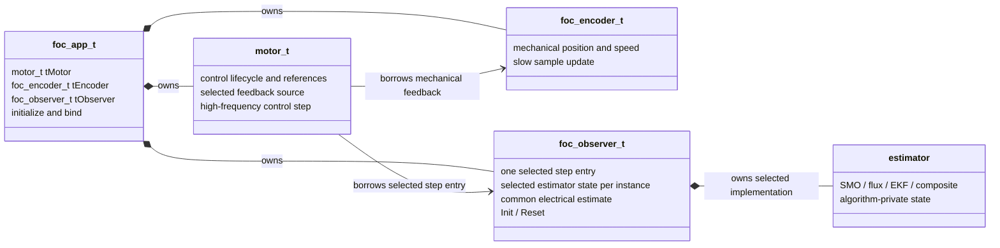
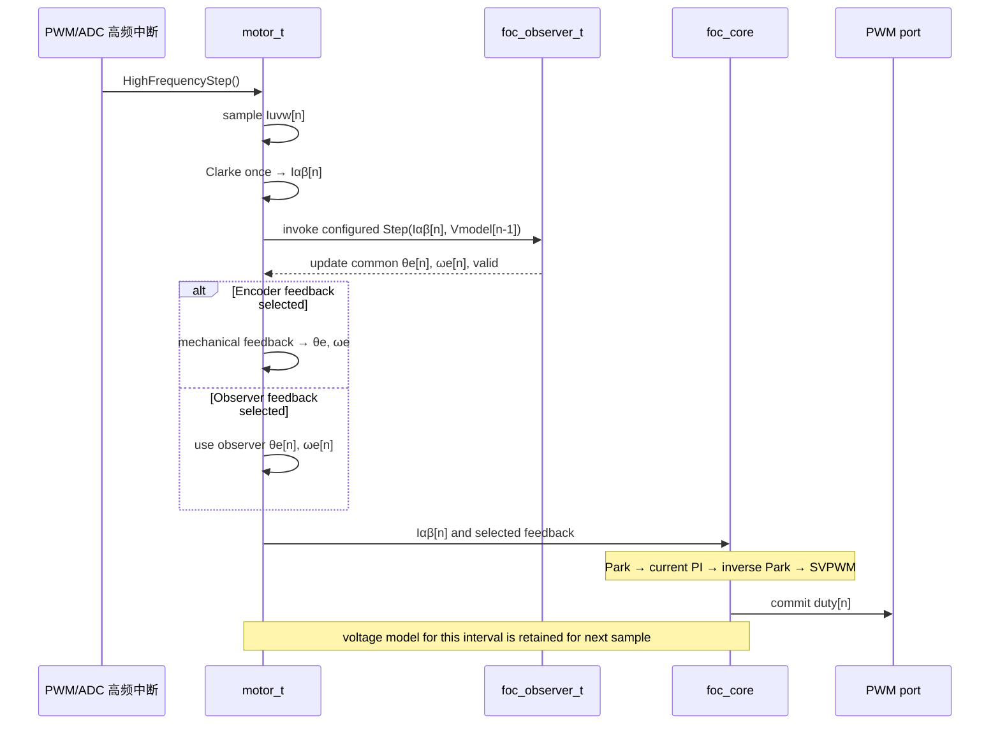
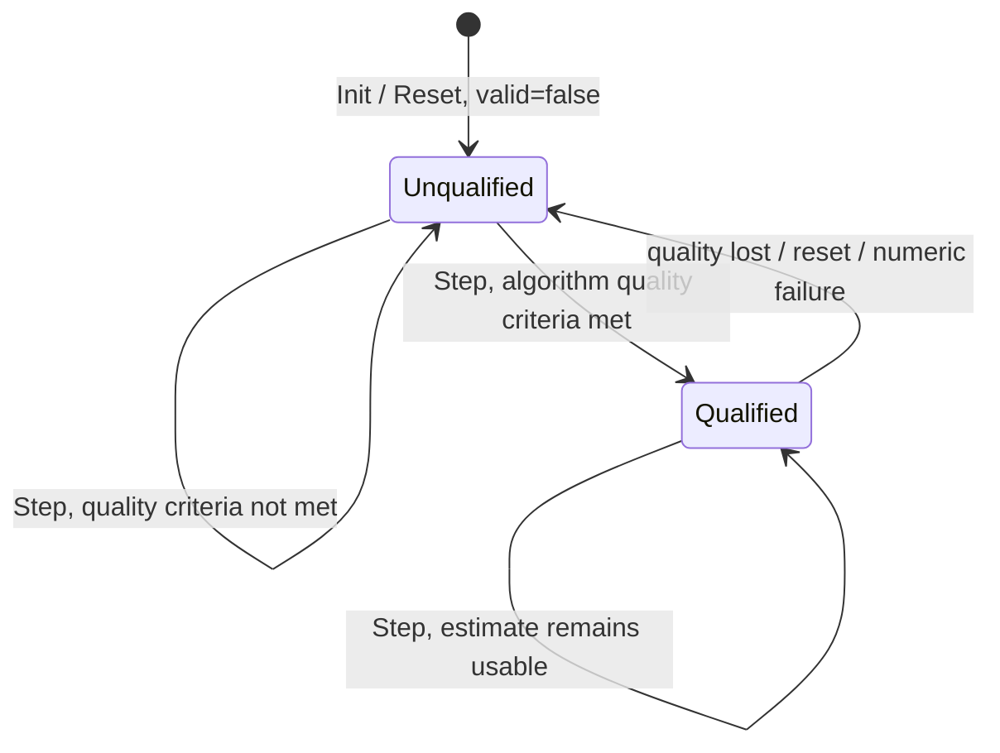

# FOC 无感估算核心框架设计

> 本文定义 FOC 无感估算的长期公共架构边界。SMO 是首个算法实现；磁链观测、
> 扩展卡尔曼滤波及基于多个估算器的融合实现，都应遵循本文的控制时序和输出契约。
> 本文描述目标设计，不表示这些能力已经进入当前固件。

## 1. 目标与边界

框架只解决一件事：让不同算法在同一高频采样时序中产生可供 FOC 使用的电气角度和
电气速度，并由 Motor 统一决定当前控制反馈源。具体算法留在 Observer 内，不让 Motor
或 App 识别 SMO、磁链算法或 EKF。

本文的共同输入适用于被动电压/电流模型估算器，例如 SMO、磁链观测和 EKF。算法还需要
的电机参数由该算法自己的配置明确提供，不扩张 `motor_params_t`，也不放入一组可选字段
过多的通用参数包。项目已有的极对数、Rs、Ld、Lq 仍以 `motor_params_t` 为唯一来源。

估算器融合可以作为一个复合算法，内部组合多个估算器并输出同一结果，不另建外层
Selector、ControlChain 或插件注册系统。若融合中包含 HFI 等主动注入算法，所需注入命令
和解调数据超出本接口，必须先另行审核输入/控制边界。I/F、V/F 和零速无感启动是启动
策略，不因实现了 Observer 就自动获得支持。

`foc/docs/foc-architecture.md` 记录当前已实现的 Encoder 架构；本文是后续无感开发的
目标设计。代码实施和硬件验证完成前，不把本文画的路径描述成当前运行事实。

## 2. 模块拓扑与所有权



- `foc_app_t` 负责静态组合与初始化，持有 Motor、Encoder 和 Observer；不在 App ISR 中
  另行调度 Observer，也不维护电压历史副本。
- `motor_t` 借用 Observer。Observer 的生命周期由 App 覆盖 Motor 生命周期；Motor 不
  拥有 Observer，也不接触具体算法状态。
- 一个 Observer 实例初始化时选择一种实现。实现可以是 SMO、磁链估算、EKF，或内部
  组合多算法的复合估算器。初始化时把唯一选中算法的 Step 入口绑定到 Observer；不使用
  堆、公开 vtable、动态注册表或第二层 Selector。
- 选定算法状态按值包含在 Observer 实例中，或绑定到其固定生命周期、独立于其它实例的
  存储；不使用 `malloc`，也不以文件级共享状态保存积分器、PLL 等运行状态。
- 算法内部状态只属于其实现；Estimator 输出通过 Observer 的统一边界交给 Motor。不要
  再包装 `observer_if_t`、机械位置回调或一串 `void *` 转发接口。
- Encoder 的机械位置接口继续服务 ALIGN 和有感反馈。无感估算输出电气量，不伪装成
  机械位置源，也不进入 `fnGetPosition()` 路径。

## 3. 高频控制数据流



数据契约：

- `Iuvw[n]` 是本次 ADC 采样。Motor 仅做一次 Clarke，Observer 和 Core 使用同一份
  `Iαβ[n]`。为把 Observer 放在 Park 前，Core 输入边界需要一次性改为接收 `Iαβ`；Core
  仍保留一个完整 Step，不拆成带中间状态的 Prepare/Finish 两段 API。ADC 的 U/V/W
  语义和采样映射不变。
- Observer 消费本拍 `Iαβ[n]` 和代表前一采样区间的 `Vmodel[n-1]`，输出与本拍电流
  样本对齐的 `θe[n]`、`ωe[n]`。`Vmodel[n-1]` 的类型明确为 `foc_ab_t`，即静止 αβ
  坐标系电压；它与 Core 逆 Park 保存的 `tVoltageAlphaBeta` 使用相同结构和坐标约定。
  `Vmodel` 先称为模型电压输入/命令，不可未经验证就宣称等于电机绕组实际电压。
- 上电/重新使能后的第一拍尚无前一运行周期的有效模型命令，因此 `Vmodel` 初值定义为
  `(foc_ab_t){ FOC_ZERO, FOC_ZERO }`。由 Core 的 `foc_core_Reset()` 清除
  `tVoltageAlphaBeta`；
  Motor 初始化和每次重新使能 PWM 前都必须经过该 Core 复位，包括 ALIGN 开始和 ALIGN
  结束后重新 Start 的路径。停止或故障时由 Motor 生命周期复位 Observer 状态；Core 历史
  至迟在下一次 PWM 使能前清零。该状态不归 `foc_pwm_Stop()` 硬件端口管理，也不要求新增
  当前不存在的 `motor_Reset()` API。
- 电角度使用项目 BAM32 表示，一个完整电周期对应 `[0, 2^32)`。电速度统一为电气圈/秒，
  与 Motor 速度环的参考单位一致；每次离散角度推进由 `ωe × Ts` 换算成圈数。算法移植
  时必须显式完成弧度/圈、机械/电气速度和极对数的换算。
- 固定控制周期 `Ts` 在 Observer 初始化时设置；算法系数在 Init 中预计算。每拍 Step 不
  再传入重复的 `dt`。Observer 需要的算法专属参数由其配置提供，不复制通用电机参数。
- `Vmodel[n-1]` 的比例、极性和实际对应区间必须通过 ADC 采样时刻、PWM 影子寄存器生效
  时刻、SVPWM 限幅和母线电压基准核实。若现有 Core 电压命令不足以代表观测器所需的
  模型输入，先停止真机调试并报告缺失事实；不在 App 增加猜测性补偿，不改外设或第三方
  计时模块绕过问题。

## 4. Observer 公共契约

公共边界只保留初始化、复位和一个每拍算法入口：

```text
Init(observer, motor_params, observer_configuration)
Reset(observer)
observer->selected_step(observer, Iαβ[n], Vmodel[n-1])
```

其中每拍电流、电压参数均为 `const foc_ab_t *`，角度估计仍使用项目 `foc_angle_t`。
`selected_step` 读取/更新 Observer 实例中固定存储的统一估算结果。

`motor_params` 直接引用 Motor 的既有参数，不在 Observer 再保存一份；
`observer_configuration` 只承载本实例所选算法需要的参数和固定 `Ts`。该伪接口说明职责，
不要求编码阶段机械照搬此结构体或增加不需要的配置层。

Observer 保存统一估算结果，Motor 在同一高频步骤中读取该结果；不增加 `GetPosition()`、
`GetSnapshot()` 或 App 到 Motor 的二次转发。`selected_step` 是在 Init 选定并绑定的直接
算法入口；Motor 不再先调用一个只转发到算法的 `foc_observer_Step()`。这样 Observer
仍是唯一适配边界，但不额外增加一层运行时调用。

`valid` 的唯一含义是：该算法的电角度和电速度当前满足其闭环使用条件。它不是“本拍
成功算出一个数”。锁定、误差、反电势/磁链质量与失锁判据属于具体算法；框架不再维护
一套重复的 Disabled/Acquiring/Tracking 状态机，也不要求所有算法共享同一组臆定阈值。

后续算法必须在设计评审中说明：

1. 是否只需要共同的 `Iαβ`、`Vmodel` 和固定 `Ts`；
2. 所需的电机常数及量纲，参数来源是否可靠；
3. 其内部状态如何产生电气角度/电气圈每秒速度以及 `valid`；
4. float 与 Q15 后端的数值范围、溢出/饱和处理和最坏执行时间。

若算法必须新增传感量、主动激励或启动控制命令，应先评审并扩展明确的数据/控制边界；
禁止在公共输入中预置未使用的可选字段来假装兼容。

## 5. 有效性与反馈源状态机

估算器的“未就绪/可用”是 `valid` 的语义，不再新增框架状态对象：



Motor 反馈源与 Voltage/Current/Speed 控制模式彼此独立。Observer 可以在 Encoder 保持控制
的情况下被逐拍推进并作 Shadow 对比；估算无效时不影响 Encoder 输出。控制源状态转换为：

```mermaid
stateDiagram-v2
    [*] --> EncoderControl
    EncoderControl: Encoder controls; Observer may run in Shadow
    EncoderControl --> EncoderControl: switch rejected; keep current output
    EncoderControl --> ObserverControl: explicit request and all gates pass
    ObserverControl --> Fault: observer invalid or estimator failure
    ObserverControl --> EncoderControl: explicit qualified request, when supported
    Fault --> EncoderControl: PWM stopped; reset source and observer
```



- 接管必须是显式请求，并确认 Observer 有效、处于已验证速度/方向范围，且与当前 Encoder
  估算的电角度和速度连续。具体阈值由仿真/台架确定，不在框架文档中猜数值。资格不符时
  拒绝请求，现有控制源和 PWM 不变。
- Observer 已作为控制反馈后若失效或计算异常，走 Motor 既有安全故障/停 PWM 路径；不
  静默回退 Encoder，避免隐藏失锁或造成控制器状态突变。显式反向切换是否开放由实现阶段
  依据已验证条件决定；自动回退不属于本框架。
- 初次硬件验证范围是 Encoder 完成 ALIGN 并带起转，Observer 在 Encoder 闭环下 Shadow，
  再在已验证工作区显式接管。此路径验证的是无感闭环运行能力，不等于零速无感启动。

## 6. 扩展规则与禁止项

- 新算法只接入 Observer 的共同输入/输出契约；Motor、Core 和 App 不增加算法类型分支。
- 估算融合是一个复合 Observer 算法，内含必要的估算器状态并输出单一结果。不要把融合
  算法选择、Motor 反馈源切换和控制模式混成一个 `ControlChain`。
- 磁链与 EKF 可能需要当前 Motor 公共参数之外的磁链/噪声模型参数。参数由对应算法配置
  管理并先验证物理来源；不要为某个算法把未经确认的磁链等字段加进 `motor_params_t`。
- HFI、I/F、V/F、零速起动及主动估算器融合超出本文被动估算输入契约。未来如需支持，
  另行设计最小激励/启动接口，不能把它们标为已经由 `Observer::Step` 兼容。
- 不增加 `ControlChain`、独立 `observer_if_t`、公开 `void *` 回调链、运行时插件注册、
  外层 Blend/Selector、重复状态机或 App 电压缓存。
- 高频入口保持 `foc_app_HighFrequencyISR → motor_HighFrequencyStep → selected_step`；
  不增加单纯转发的 Observer Step 包装。实时生产路径实际调用深度不得超过项目规定的
  3 层；实现时连同算法内部调用、函数指针和数学辅助函数一起审计，并检查栈和耗时。
  若选定算法无法满足该约束，先停下提出最小重构/评审，不用宏或未验证 inline 隐藏层级。

## 7. 验收基线

无感框架实现完成前，以下项目都属于 Gate，而非默认成立的事实：

- Encoder 原控制路径回归：U/V/W 采样语义、ALIGN、极对数与电气零位、速度 PI、Core 和
  PWM 提交结果不因 Observer 接入而意外变化。
- Observer 单测覆盖初始化/复位、有效与失锁、正反转、角度回绕、float/Q15 数值边界；
  每个算法另有其对应的信号/收敛测试。
- 先测 Encoder 闭环基线，再测每种 Observer 的 Shadow 增量；融合按组合最坏耗时单独测。
  以当前 20 kHz、50 μs 周期为预算，记录峰值并保留余量；不得仅凭一次平均耗时宣称通过。
- 完成硬件电压模型时序/量纲核实后才进入 Observer 台架调试；切换测试确认拒绝门槛、
  失锁停机和切换后的电流环/速度环稳定性。
- 性能超限时先停止新增算法并定位算法耗时；不改 `perf_counter` 第三方实现，不改采样
  频率来掩盖预算问题。
