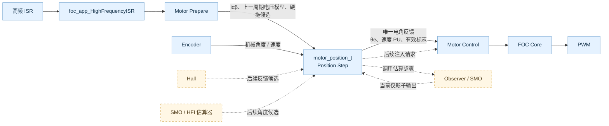

# FOC 框架

FOC 框架面向单台电机，支持 FLOAT 和 Q16.15 FIXED 数值后端。`foc_app_t` 组合 Motor、Position、Encoder 和 Identify；目标适配层提供 ADC、PWM 与原始传感器绑定。

## 架构说明

- [FOC 架构与 ISR 时序](docs/foc-architecture.md)：模块职责、Position 边界和 RUN/ALIGN 数据流。

## 电角反馈框架

FOC Core 和 Motor 只消费一组电角反馈，不依赖反馈来自哪种传感器或估算器。接口 `motor_electrical_feedback_t` 包含 BAM32 电角度、电角速度 PU 和有效标志；Position 每个控制周期产出这组唯一反馈，再交给 Motor 执行速度环和 FOC Core。

| 职责 | 所属模块 |
|---|---|
| 采样并编排 Prepare、Position、Control 的周期顺序 | `foc_app_t` |
| 生成有感或无感候选反馈，各自维护算法状态 | Encoder、Observer/估算器等来源模块 |
| 保存来源状态，换算和校正角度，并决定选择或融合策略 | App 持有的 `motor_position_t` |
| 生成开环候选、执行电流控制和 PWM | Motor |
| 消费最终电角反馈完成控制 | Motor / FOC Core |

实线表示当前已有的数据流；虚线表示可接入的扩展边界，当前没有对应的融合或注入实现。

这个边界允许后续接入 Hall、SMO、HFI 等反馈来源：各来源产出带角度、速度和有效性的候选，由 Position 统一选择或融合，Motor/Core 接口不随来源变化。融合决策属于 Position；估算算法留在各来源模块。HFI 的角度解调属于估算来源，注入电压则需要单独接入 Motor 的电压命令路径。

当前框架已有统一最终反馈、同步 ISR 样本和 Position 策略状态的扩展位置；实际选源只支持初始化时选择 Encoder 或固定频率硬拖候选。Observer 若启用只作影子估算。通用多估算器候选接口、角度融合、运行中切换、无感接管和 HFI 注入接口还未实现，不能视为已具备的运行功能。

## 当前实现

不同电机和 FOC 应用需要调整的运行参数集中在 [`app/motor_config.h`](app/motor_config.h)：电机参数、PU 基值、位置来源、PI、编码器、Observer 和辨识配置。`foc_app.c` 内的 initializer 只负责把这组值组装成运行配置；板级 ADC/PWM 标定和 `FOC_HF_ISR_HZ` 仍由 `foc_config.h` 与目标配置提供。

RUN 高频路径由 App 编排为 `Motor Prepare → Position Step → Motor Control`。Motor 负责同步采样、Clarke、开环固定频率电角候选、速度环、FOC Core、PWM、安全状态和 ALIGN；App 按值持有 `motor_position_t`，把当前来源转换为唯一的电角度、电角速度和有效标志，再交给 Motor/Core。当前已接入 Encoder 电角反馈；ALIGN 的传感器零位捕获也由 App/Position 执行，结果回告 Motor。

Position 目前在初始化时选择 Encoder 或 Motor 开环候选，默认选择 Encoder。选择硬拖时需设置 `MOTOR_CONFIG_POSITION_SOURCE` 并配置 `MOTOR_CONFIG_HARD_DRAG_ELECTRICAL_MILLIHZ`；Motor Init 预计算角度步长和速度 PU，RUN ISR 逐步发布固定频率候选。该通路没有加速曲线或自动切换。

`FOC_ENABLE_SMO` 在 [`foc_config.h`](foc_config.h) 中配置，当前值为 `1`。SMO 只作为影子估算运行，闭环速度控制仍使用 Encoder 反馈；`FOC_MODE_POSITION` 仍未实现。FOC 构建固定列入 `foc_smo.c`，宏关闭时不选择 SMO 后端，链接器会回收未引用代码段。

R/L 辨识的固定宏仍作为 Motor 参数输入；辨识模块维持独立的前台 PT 与 ISR 样本接口，不属于 Position 的职责。

## 构建与验证

构建入口在[顶层 Makefile](../makefile)，FOC 主机测试位于[`foc/tests`](tests/)；板级行为仍需结合目标硬件和 PWM/ADC 时序实测。
