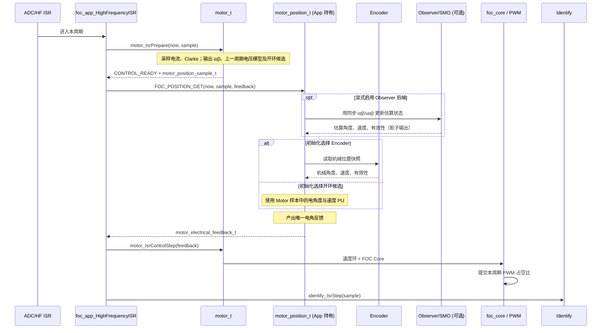

# FOC 当前架构与 ISR 时序

本文描述当前代码实际执行的边界。运行时代码以 `foc_app_t` 组合对象为入口；
Position 策略由 App 按值持有，Motor 只接收最终电角反馈。

## 所有权与职责

| 模块 | 所有状态/职责 | 当前边界 |
|---|---|---|
| `foc_app_t` | 组合 `motor_t`、`motor_position_t`、`foc_encoder_t`、`identify_t`；编排前台和 ISR 顺序 | 组合层，不实现 FOC 数学 |
| `motor_t` | 电流采样与 Clarke、固定频率开环候选、速度环、`foc_core`、PWM、安全状态、ALIGN | 不读取编码器或选择角度源 |
| `motor_position_t` | App 所有的电角反馈状态、传感器零位、极对数换算增益、固定来源选择 | `Step()` 给 Motor/Core 产出唯一反馈 |
| Encoder | 采集和发布机械角度、机械速度 | Position 的当前有感来源 |
| Observer/SMO | 估算器算法和估算状态 | `FOC_ENABLE_SMO` 在 `foc_config.h` 选择后端；当前启用影子估算，不控制 Motor |
| Identify | 电阻/Ld 辨识的前台状态机与 ISR 样本消费 | 在 Motor 本周期控制步骤之后运行 |
| 目标 FOC 适配层 | 采样、PWM、原始位置读取的编译期绑定 | 不向 Motor 注入运行时函数表 |

`motor_electrical_feedback_t` 包含 BAM32 电角度、电角速度 PU 和 `bValid`。
Motor 不需要知道该反馈来自编码器、Hall 或估算器，也不使用机械角度。

## RUN 高频时序

Motor 的 Prepare 与 Control 在同一 ISR 紧邻执行，中间只运行 Position 策略；
因此本周期样本可用于本周期角度更新，Motor 不重复采样或 Clarke。Position
错误或反馈无效时，Motor 锁存位置故障并安全停止控制输出。

## ALIGN 时序

ALIGN 仍由 Motor 控制固定电角度、电流环和 PWM。达到保持周期后，Prepare 返回
捕获零位事件；App 调用 Position 的传感器零位捕获，再把成功/失败结果交还 Motor。
每次重新 ALIGN 都先使旧电零位失效，捕获失败不会保留旧的有效标记。

## 当前实现与目标图的差异

- **已实现：** App 调用 Prepare，传递同步 ISR 样本给 Position；Position 输出唯一
  电角反馈；Motor 使用它执行速度环/Core/PWM。
- **已实现：** Encoder 角度、电角速度 PU 换算与 ALIGN 零位交接。
- **已实现：** Motor 在 RUN Prepare 发布固定频率开环角度/速度候选，Position 可在
  Init 时选用；默认仍选 Encoder。候选步长与速度 PU 在 Motor Init 换算，Start
  重置相位。ALIGN 是独立的固定角对齐步骤。
- **未实现：** Position 向 Motor/Core 返回 HFI 注入请求。当前反馈结构只有电角度、
  速度和有效标志；Motor 也没有注入请求合成接口。
- **影子估算：** 当前 `FOC_ENABLE_SMO=1`，Position 会运行 SMO Observer，但控制角仍来自 Encoder；SMO 专项测试仍待恢复，电压时序与实机结果也未验收。
- **未实现：** 运行中来源切换、Hall 多源仲裁、无感接管和角度融合。默认控制来源是 Encoder。

开环候选当前是固定频率相位轨迹，尚无加速/限流启动流程；选择它不等于已实现
SMO 接管。HFI 注入请求仍是后续接口能力。

## 编译开关与验证

`FOC_ENABLE_SMO` 在 `foc_config.h` 中配置，当前值为 `1`。FOC 源文件列表固定包含
`foc_smo.c`；该宏选择 Observer 后端。宏设为 `0` 时，Observer/SMO 状态与调用路径不启用，链接器回收未引用的 SMO 代码段。启用 SMO 只运行影子估算，不会自动切换 Motor 的控制角度。
SMO 重写前，`run_smo_test.ps1` 和 `run_smo_hotpath_contract_test.ps1` 明确输出
`SKIP`。
