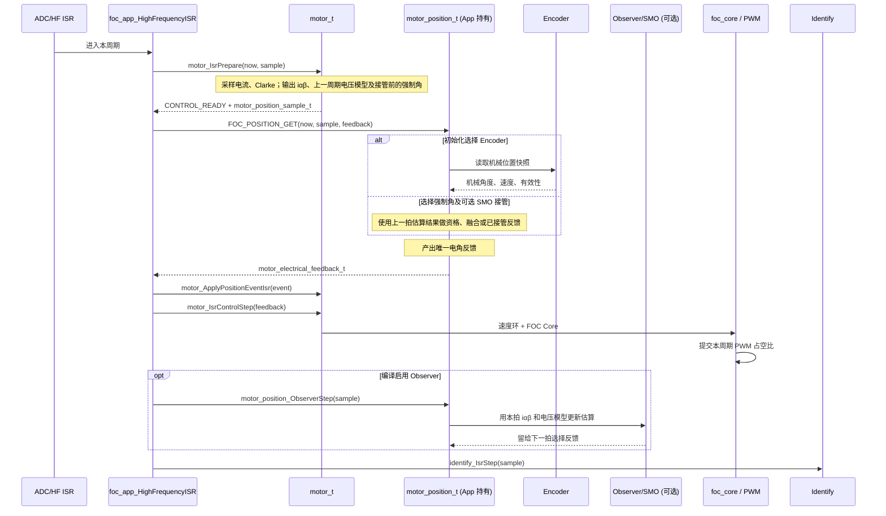

# FOC 当前架构与 ISR 时序

本文描述当前代码实际执行的边界。运行时代码以 `foc_app_t` 组合对象为入口；
Position 策略由 App 按值持有，Motor 只接收最终电角反馈。

## 所有权与职责

| 模块 | 所有状态/职责 | 当前边界 |
|---|---|---|
| `foc_app_t` | 组合 `motor_t`、`motor_position_t`、`foc_encoder_t`、`identify_t`；编排前台和 ISR 顺序 | 组合层，不实现 FOC 数学 |
| `motor_t` | 电流采样与 Clarke、定频或斜坡强制角、速度环、`foc_core`、PWM、安全状态、ALIGN | 不读取编码器或选择角度源；接管事件后停止强制角更新 |
| `motor_position_t` | 传感器零位、反馈选择、SMO 质量状态与交接状态 | `Step()` 给 Motor/Core 产出唯一反馈 |
| Encoder | 采集和发布机械角度、机械速度 | Position 的当前有感来源 |
| Observer/SMO | 估算器算法和估算状态 | 默认只作影子估算；显式配置后参与强拖接管 |
| Identify | 电阻/Ld 辨识的前台状态机与 ISR 样本消费 | 在 Motor 本周期控制步骤之后运行 |
| 目标 FOC 适配层 | 采样、PWM、原始位置读取的编译期绑定 | 不向 Motor 注入运行时函数表 |

`motor_electrical_feedback_t` 包含 BAM32 电角度、电角速度 PU 和 `bValid`。
Motor 不需要知道该反馈来自编码器、Hall 或估算器，也不使用机械角度。

## RUN 高频时序

```mermaid
sequenceDiagram
    participant IRQ as ADC/HF ISR
    participant App as foc_app_HighFrequencyISR
    participant Motor as motor_t
    participant Pos as motor_position_t (App 持有)
    participant Enc as Encoder
    participant Obs as Observer/SMO (可选)
    participant Core as foc_core / PWM
    participant Id as Identify

    IRQ->>App: 进入本周期
    App->>Motor: motor_IsrPrepare(now, sample)
    Note over Motor: 采样电流、Clarke；输出 iαβ、上一周期电压模型及接管前的强制角
    Motor-->>App: CONTROL_READY + motor_position_sample_t
    App->>Pos: FOC_POSITION_GET(now, sample, feedback)
    alt 初始化选择 Encoder
        Pos->>Enc: 读取机械位置快照
        Enc-->>Pos: 机械角度、速度、有效性
    else 选择强制角及可选 SMO 接管
        Note over Pos: 使用上一拍估算结果做资格、融合或已接管反馈
    end
    Note over Pos: 产出唯一电角反馈
    Pos-->>App: motor_electrical_feedback_t
    App->>Motor: motor_ApplyPositionEventIsr(event)
    App->>Motor: motor_IsrControlStep(feedback)
    Motor->>Core: 速度环 + FOC Core
    Core->>Core: 提交本周期 PWM 占空比
    opt 编译启用 Observer
        App->>Pos: motor_position_ObserverStep(sample)
        Pos->>Obs: 用本拍 iαβ 和电压模型更新估算
        Obs-->>Pos: 留给下一拍选择反馈
    end
    App->>Id: identify_IsrStep(sample)
```

Motor 的 Prepare 与 Control 在同一 ISR 内执行，中间由 Position 选出唯一反馈。
SMO 在控制和 PWM 提交后更新，本拍控制使用上一拍的估算；Position 在初始化时
预计算一拍角度预测增益。Position 错误或反馈无效时，Motor 锁存位置故障并安全停机。

## ALIGN 时序

ALIGN 由 Motor 控制固定电角度、电流环和 PWM。有感校准在保持时间结束后由
Position 捕获传感器零位；无感启动则保持 PWM，转入强制角斜坡。重新 ALIGN 时
旧电零位先失效，捕获失败不会保留旧的有效标记。

## 当前能力与扩展边界

- **已实现：** App 调用 Prepare，传递同步 ISR 样本给 Position；Position 输出唯一
  电角反馈；Motor 使用它执行速度环/Core/PWM。
- **已实现：** Encoder 角度、电角速度 PU 换算与 ALIGN 零位交接。
- **已实现：** 旧定频强制角与限流 ALIGN 后的 I/f 斜坡；SMO 资格计数、限角度
  修正、速度融合和接管事件。接管后 Motor 停止强制角计算，Position 只校验和输出
  SMO 反馈。默认仍选 Encoder，启动斜坡和自动接管默认关闭。
- **未实现：** HFI 注入与同步采样、HFI+SMO 并行、EKF，以及任意多来源仲裁。
  以后可以保留 `motor_position_Step()` 的唯一反馈输出；新算法须先有自己的采样、
  质量判断和延迟约定，再按实际来源增加交接策略。
- **安全与验证：** 自动接管参数仍需带载与最坏 ISR 时延的台架验证；主机测试
  只覆盖软件状态与边界。

## 编译开关与验证

`FOC_OBSERVER_BACKEND` 当前只能选择 NONE 或 SMO；`FOC_ENABLE_SMO=1` 不等于
自动接管。HFI+SMO 需要同时拥有两个具体估算器及 HFI 硬件链路，不能只增加
一个编译期后端枚举。现有资格与融合流程只针对强拖到 SMO；未来出现第二条
真实路径时再抽取共用步骤，不预设置信度注册表或运行时函数指针。
